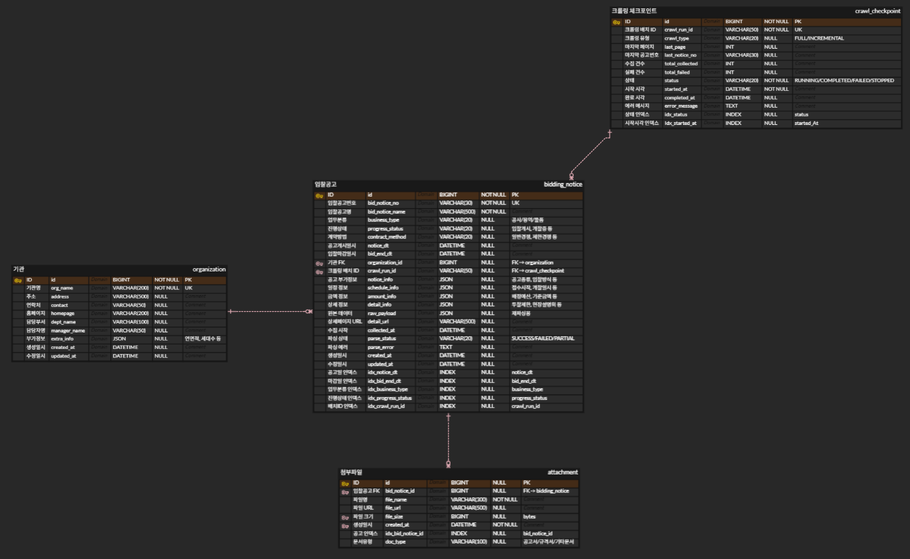

# reco-bid-collector

누리장터(nuri.g2b.go.kr) 입찰공고를 자동 수집하는 크롤러입니다.

동적으로 렌더링되는 WebSquare SPA 페이지에서 목록 탐색 → 상세 진입 → 필드 추출 → DB 저장까지 자동화합니다.

---

## 빠른 시작

### 사전 준비

| 항목 | 버전 | 비고 |
|------|------|------|
| Java | 21+ | `java -version`으로 확인 |
| MariaDB | 10.6+ | MySQL 8.0+ 호환 가능 |
| Chrome | 120+ | Selenium이 자동 제어 |
| Gradle | 9.3 | wrapper 포함 (별도 설치 불필요) |

### 1. DB 실행

```bash
# Docker Compose로 MariaDB 실행 (권장)
docker compose up -d
```

> 직접 MariaDB를 설치한 경우:
> ```sql
> CREATE DATABASE bidding_collector CHARACTER SET utf8mb4 COLLATE utf8mb4_unicode_ci;
> CREATE USER 'reco'@'localhost' IDENTIFIED BY 'reco1234';
> GRANT ALL PRIVILEGES ON bidding_collector.* TO 'reco'@'localhost';
> ```

테이블은 JPA `ddl-auto: update`로 자동 생성됩니다.

### 2. 앱 실행

```bash
./gradlew bootRun
```

> Selenium이 로컬 Chrome을 직접 제어하므로, 앱은 Docker가 아닌 로컬에서 실행해야 합니다.

### 3. 크롤링 시작

```bash
# 전체 수집
curl -X POST "http://localhost:8080/api/scrape/start?type=FULL&async=true"

# 필터 적용 수집 (예: 환경 관련 용역 공고)
curl -X POST "http://localhost:8080/api/scrape/start?type=FULL&async=true&keyword=환경&businessType=용역"

# 진행 상황 확인
curl http://localhost:8080/api/scrape/status

# 수동 중지
curl -X POST http://localhost:8080/api/scrape/stop
```

### 4. 환경 변수 (선택)

기본값이 설정되어 있어 별도 설정 없이 실행 가능합니다. 변경이 필요한 경우:

```bash
SPRING_DATASOURCE_URL=jdbc:mariadb://localhost:3306/bidding_collector
SPRING_DATASOURCE_USERNAME=reco
SPRING_DATASOURCE_PASSWORD=reco1234
```

---

## 프로젝트 구조

```
src/main/java/io/reco/collector/
├── application/api/              # REST API (ScraperController, GlobalExceptionHandler)
├── common/entity/                # BaseTimeEntity (JPA Auditing)
├── config/                       # JPA 설정
├── domain/
│   ├── bidding/                  # 입찰공고 (Entity, Service, Repository, DTO, Enum)
│   ├── checkpoint/               # 크롤링 체크포인트 (중단점 복구)
│   └── organization/             # 기관 정보 (정규화)
└── infrastructure/crawler/       # 크롤링 인프라
    ├── config/                   # WebDriver, CrawlerProperties, SearchFilter
    └── parser/                   # ListPageParser, DetailPageParser
```

---

## 설계 및 주요 가정

### 아키텍처

```
[API 요청] → ScraperController → ScraperService (크롤링 조율)
                                      │
                       ┌──────────────┼──────────────┐
                       ▼              ▼              ▼
                 ListPageParser  DetailPageParser  CheckpointService
                 (목록 탐색)    (상세 파싱)       (중단점 관리)
                       │              │              │
                       └──────────────┼──────────────┘
                                      ▼
                              BiddingNoticeService → MariaDB
```

### 핵심 설계 결정

**1. WebSquare SPA 대응 — Selenium 선택**

누리장터는 WebSquare 프레임워크 기반 SPA로, 일반적인 HTTP 요청으로는 데이터를 가져올 수 없습니다.
JavaScript 렌더링이 완료된 후에야 DOM에 데이터가 존재하므로 Selenium을 통한 브라우저 자동화 방식을 채택했습니다.

**2. 동적 필드 추출 — `td[data-title]` 일괄 파싱**

상세 페이지의 필드는 공고마다 다를 수 있습니다. 특정 필드를 하드코딩하는 대신,
페이지 내 모든 `td[data-title]` 요소를 동적으로 추출하여 누락 없이 수집합니다.

추출된 필드는 4개 JSON 섹션으로 자동 분류됩니다:

| 컬럼 | 내용 | 예시 |
|------|------|------|
| `notice_info` | 공고 기본정보 | 문서번호, 공고종류, 입찰방식 |
| `schedule_info` | 일정정보 | 개찰일시, 개찰장소 |
| `amount_info` | 금액정보 | 배정예산, 기준금액 |
| `detail_info` | 나머지 + 그리드 | 적격심사, 용역상세내역 |
| `raw_payload` | 전체 원본 | 모든 추출 데이터 JSON |

**3. 체크포인트 기반 중단점 복구**

크롤링 중 오류로 중단되더라도 `crawl_checkpoint` 테이블에 마지막 페이지/공고번호가 기록됩니다.
재실행 시 해당 지점부터 이어서 수집합니다.

**4. 검색 필터 — WebSquare API 활용**

일반적인 Selenium `sendKeys()`로는 WebSquare 컴포넌트의 값이 변경되지 않습니다.
`$w.getComponentById().setValue()` JavaScript API를 직접 호출하여 필터를 적용합니다.

```java
// WebSquare 컴포넌트에 직접 값 설정
js.executeScript("$w.getComponentById('cboBusinessType').setValue('" + value + "')");
```

### 주요 가정

- 누리장터의 DOM 구조(`td[data-title]`, `col_id` 등)가 유지된다고 가정합니다
- Chrome 브라우저가 로컬에 설치되어 있다고 가정합니다 (ChromeDriver는 자동 관리)
- 크롤링 대상은 1개월 이내 공고입니다 (SearchFilter `periodMonths` 기본값)

---

## 겪었던 문제와 해결

### 1. implicit wait가 상세 파싱을 10분 이상 블로킹

**증상**: 상세 페이지 클릭 후 파싱이 시작되지 않고 무한 대기

**원인**: `extractCellValue()`에서 각 `td` 셀마다 `findElements(By.tagName("select"))`를 호출하는데,
implicit wait가 10초로 설정되어 있어 `<select>`가 없는 셀마다 **10초씩 대기**했습니다.
50개 셀이면 `50 x 10초(select) + 50 x 10초(span) = 최대 1000초`.

**해결**: `parseDetailPage()` 진입 시 `implicitlyWait(Duration.ZERO)`로 설정하고, 파싱 완료 후 복원합니다.

```java
driver.manage().timeouts().implicitlyWait(Duration.ZERO);
try {
    // 파싱 로직 (findElements가 즉시 반환)
} finally {
    driver.manage().timeouts().implicitlyWait(Duration.ofSeconds(10));
}
```

### 2. WebSquare 팝업이 클릭을 가로챔

**증상**: 상세 페이지 클릭 시 `ElementClickInterceptedException` 발생

**원인**: 누리장터 접속 시 공지사항 팝업이 목록 위에 오버레이되어 클릭이 차단됨

**해결**: 클릭 전 `closePopups()`로 팝업 닫기 버튼 클릭 + JavaScript `display:none` 처리

### 3. WebSquare 컴포넌트에 sendKeys가 동작하지 않음

**증상**: 키워드 입력 필드에 `sendKeys()`로 텍스트를 입력해도 검색에 반영되지 않음

**원인**: WebSquare는 자체 데이터 바인딩을 사용하여 DOM의 value 속성 변경만으로는 내부 상태가 갱신되지 않음

**해결**: WebSquare JavaScript API를 직접 호출하여 컴포넌트 값을 설정

### 4. 마지막 페이지 감지 실패로 무한루프

**증상**: 모든 데이터를 수집한 후에도 크롤링이 끝나지 않음

**원인**: 누리장터의 "다음" 버튼에 `disabled` 클래스가 적용되지 않아 마지막 페이지를 감지하지 못함

**해결**: 한 페이지에서 신규 수집 건수가 0이면(전부 중복) 자동 종료

---

## API

| Method | Endpoint | 설명 | 파라미터 |
|--------|----------|------|----------|
| POST | `/api/scrape/start` | 크롤링 시작 | `type` (FULL/INCREMENTAL), `async`, `keyword`, `businessType`, `progressStatus`, `periodMonths`, `noticeType` |
| POST | `/api/scrape/stop` | 크롤링 중지 | - |
| GET | `/api/scrape/status` | 진행 상황 조회 | - |

**응답 예시** (`/api/scrape/status`):
```json
{
  "runId": "crawl_20260208_212006",
  "type": "FULL",
  "status": "COMPLETED",
  "lastPage": 2,
  "totalCollected": 18,
  "totalFailed": 0,
  "startedAt": "2026-02-08T21:20:06",
  "completedAt": "2026-02-08T21:34:15"
}
```

---

## ERD



### 테이블 관계

| 관계 | 설명 |
|------|------|
| organization → bidding_notice | 1:N — 하나의 기관이 여러 입찰공고를 등록 |
| crawl_checkpoint → bidding_notice | 1:N — 하나의 크롤링 배치에서 여러 공고 수집 |
| bidding_notice → attachment | 1:N — 하나의 입찰공고에 여러 첨부파일 |

### 1. bidding_notice (입찰공고)

누리장터에서 수집한 입찰공고 정보를 저장하는 메인 테이블

| 컬럼 | 물리명 | 타입 | NULL | 비고 |
|------|--------|------|------|------|
| ID | id | BIGINT | NOT NULL | PK |
| 입찰공고번호 | bid_notice_no | VARCHAR(30) | NOT NULL | UK |
| 입찰공고명 | bid_notice_name | VARCHAR(500) | NOT NULL | |
| 업무분류 | business_type | VARCHAR(20) | NULL | 공사/용역/물품 |
| 진행상태 | progress_status | VARCHAR(20) | NULL | 입찰개시, 개찰중, 개찰완료 등 |
| 계약방법 | contract_method | VARCHAR(20) | NULL | 일반경쟁, 제한경쟁 등 |
| 공고게시일시 | notice_dt | DATETIME | NULL | |
| 입찰마감일시 | bid_end_dt | DATETIME | NULL | |
| 기관 FK | organization_id | BIGINT | NULL | FK → organization |
| 크롤링 배치 ID | crawl_run_id | VARCHAR(50) | NULL | FK → crawl_checkpoint |
| 공고 부가정보 | notice_info | JSON | NULL | 공고종류, 입찰방식 등 |
| 일정정보 | schedule_info | JSON | NULL | 접수시작, 개찰일시 등 |
| 금액정보 | amount_info | JSON | NULL | 배정예산, 기준금액 등 |
| 상세정보 | detail_info | JSON | NULL | 투찰제한, 현장설명회 등 |
| 원본 데이터 | raw_payload | JSON | NULL | 재파싱용 |
| 상세페이지 URL | detail_url | VARCHAR(500) | NULL | |
| 수집 시각 | collected_at | DATETIME | NULL | |
| 파싱 상태 | parse_status | VARCHAR(20) | NULL | SUCCESS/FAILED/PARTIAL |
| 파싱에러 | parse_error | TEXT | NULL | |
| 생성일시 | created_at | DATETIME | NOT NULL | |
| 수정일시 | updated_at | DATETIME | NULL | |

**인덱스:**

| 인덱스명 | 대상 | 용도 |
|----------|------|------|
| idx_notice_dt | notice_dt | 공고일 정렬/범위검색 |
| idx_bid_end_dt | bid_end_dt | 마감일 정렬/범위검색 |
| idx_business_type | business_type | 업무분류 필터 |
| idx_progress_status | progress_status | 진행상태 필터 |
| idx_crawl_run_id | crawl_run_id | 배치별 조회 |

### 2. organization (기관/단지)

입찰공고를 등록한 발주기관/단지 정보. 중복 저장 방지용 정규화 테이블

| 컬럼 | 물리명 | 타입 | NULL | 비고 |
|------|--------|------|------|------|
| ID | id | BIGINT | NOT NULL | PK |
| 기관명 | org_name | VARCHAR(200) | NOT NULL | UK |
| 주소 | address | VARCHAR(500) | NULL | |
| 연락처 | contact | VARCHAR(50) | NULL | |
| 홈페이지 | homepage | VARCHAR(200) | NULL | |
| 담당부서 | dept_name | VARCHAR(100) | NULL | |
| 담당자명 | manager_name | VARCHAR(50) | NULL | |
| 부가정보 | extra_info | JSON | NULL | 연면적, 세대수 등 |
| 생성일시 | created_at | DATETIME | NULL | |
| 수정일시 | updated_at | DATETIME | NULL | |

### 3. attachment (첨부파일)

입찰공고에 첨부된 파일 정보

| 컬럼 | 물리명 | 타입 | NULL | 비고 |
|------|--------|------|------|------|
| ID | id | BIGINT | NOT NULL | PK |
| 입찰공고 FK | bid_notice_id | BIGINT | NULL | FK → bidding_notice |
| 파일명 | file_name | VARCHAR(300) | NOT NULL | |
| 파일 URL | file_url | VARCHAR(500) | NULL | |
| 파일 크기 | file_size | BIGINT | NULL | bytes |
| 문서유형 | doc_type | VARCHAR(100) | NULL | 공고서/규격서/기타문서 |
| 생성일시 | created_at | DATETIME | NOT NULL | |

**인덱스:**

| 인덱스명 | 대상 | 용도 |
|----------|------|------|
| idx_bid_notice_id | bid_notice_id | FK 조인 최적화 |

### 4. crawl_checkpoint (크롤링 체크포인트)

크롤링 실행 상태 관리. 중단 후 재개, 실행 이력 추적용

| 컬럼 | 물리명 | 타입 | NULL | 비고 |
|------|--------|------|------|------|
| ID | id | BIGINT | NOT NULL | PK |
| 크롤링 배치 ID | crawl_run_id | VARCHAR(50) | NOT NULL | UK |
| 크롤링 유형 | crawl_type | VARCHAR(20) | NULL | FULL/INCREMENTAL |
| 마지막 페이지 | last_page | INT | NULL | |
| 마지막 공고번호 | last_notice_no | VARCHAR(30) | NULL | |
| 수집 건수 | total_collected | INT | NULL | |
| 실패 건수 | total_failed | INT | NULL | |
| 상태 | status | VARCHAR(20) | NOT NULL | RUNNING/COMPLETED/FAILED/STOPPED |
| 시작 시각 | started_at | DATETIME | NOT NULL | |
| 완료 시각 | completed_at | DATETIME | NULL | |
| 에러 메시지 | error_message | TEXT | NULL | |

**인덱스:**

| 인덱스명 | 대상 | 용도 |
|----------|------|------|
| idx_status | status | 상태별 조회 |
| idx_started_at | started_at | 최근 크롤링 조회 |

---

## 결과 산출물 예시

> 전체 샘플 파일: [`docs/samples/sample-notice-detail.json`](docs/samples/sample-notice-detail.json) (상세 1건) / [`docs/samples/sample-notice-list.json`](docs/samples/sample-notice-list.json) (목록 18건)

<details>
<summary>수집 결과 (JSON)</summary>

```json
{
  "bidNoticeNo": "R26BK01323459-000",
  "bidNoticeName": "환경 및 재해영향평가 업체 선정 입찰공고",
  "businessType": "SERVICE",
  "progressStatus": "BID_START",
  "contractMethod": "OPEN_COMPETITION",
  "noticeDt": "2026-02-13T10:00:00",
  "bidEndDt": "2026-02-24T15:00:00",
  "orgName": "가능4구역 재개발정비사업조합",
  "managerName": "서용엄",
  "noticeInfo": {
    "문서번호": "제20260206-12호",
    "긴급입찰여부": "아니오",
    "공고종류": "실공고",
    "공고처리구분": "등록공고",
    "입찰방식": "전자입찰",
    "낙찰방법": "적격심사제",
    "재입찰여부": "예"
  },
  "scheduleInfo": {
    "개찰일시": "2026/02/24 16:00",
    "입찰참가자격등록마감일시": "2026/02/23 18:00",
    "개찰장소": "가능4구역 재개발정비사업조합 사무실",
    "현장설명회일시": "2026/02/13 16:30",
    "현장설명회장소": "가능4구역 재개발정비사업조합 사무실"
  },
  "amountInfo": {
    "부가가치세포함여부": "아니오",
    "배정예산": "원",
    "기준금액사용여부": "아니오",
    "기준금액": "원"
  },
  "detailInfo": {
    "적격심사대상여부": "예",
    "적격심사표": "수기 등록 총점 입력",
    "지역제한": "공고서참조",
    "업종제한": "공고서참조"
  },
  "attachments": [
    {
      "fileName": "10.환경 및 재해영향평가 업체 선정 별지서식 및 배점표.hwp",
      "fileSize": 46080,
      "docType": "기타문서"
    },
    {
      "fileName": "10.환경 및 재해영향평가 업체 선정 입찰공고.pdf",
      "fileSize": 46899,
      "docType": "공고서(원본)"
    }
  ]
}
```

</details>

---

## 기술 스택

| 구분 | 기술 | 버전 | 선택 이유 |
|------|------|------|-----------|
| Language | Java | 21 | Spring 생태계 활용, Virtual Thread 등 최신 기능 지원 |
| Framework | Spring Boot | 4.0.2 | DI/AOP/스케줄링/비동기 등 엔터프라이즈 기능을 최소 설정으로 사용 |
| ORM | Spring Data JPA + Hibernate | - | 반복적인 CRUD 코드 제거, 엔티티 기반 스키마 자동 관리 |
| DB | MariaDB | 10.6+ | JSON 컬럼 네이티브 지원, MySQL 호환으로 범용성 확보 |
| 크롤링 | Selenium WebDriver | 4.18.1 | 아래 [Selenium vs Playwright](#selenium-vs-playwright) 참조 |
| 드라이버 관리 | WebDriverManager | 5.7.0 | Chrome 버전에 맞는 ChromeDriver를 자동 감지/다운로드 |
| 재시도 | Spring Retry | 2.0.11 | `@Retryable` 선언만으로 exponential backoff 재시도 적용 |
| 빌드 | Gradle | 9.3 | Wrapper 포함으로 별도 설치 불필요, 빠른 증분 빌드 |

### Selenium vs Playwright

누리장터는 **WebSquare 프레임워크** 기반 SPA로, 브라우저 자동화 도구가 필수입니다. 두 가지 주요 선택지를 비교했습니다:

| 항목 | Selenium | Playwright |
|------|----------|------------|
| **WebSquare JS API 호출** | `JavascriptExecutor`로 `$w.getComponentById().setValue()` 직접 실행 가능 | `page.evaluate()`로 동일하게 가능 |
| **Java 생태계 통합** | Spring Boot와 동일 JVM에서 네이티브 동작, 별도 프로세스 불필요 | Java 바인딩 존재하나, 내부적으로 Node.js 서버를 별도 프로세스로 실행 |
| **의존성 단순성** | `selenium-java` 단일 의존성 + WebDriverManager | `playwright` 의존성 + Node.js 런타임 + 브라우저 바이너리 별도 설치 필요 |
| **레퍼런스** | Java 크롤링 분야 사실상 표준, 풍부한 한국어 자료 | 상대적으로 JS/Python 생태계 중심, Java 레퍼런스 제한적 |
| **안정성** | WebSquare와의 호환성이 실전에서 검증됨 | WebSquare 환경에서의 검증 사례 부족 |

**결론**: Playwright가 속도/안정성 면에서 장점이 있지만, Java + Spring Boot 프로젝트에서 **추가 런타임(Node.js) 없이 동일 JVM에서 동작**하는 Selenium이 의존성과 배포 측면에서 더 적합합니다. WebSquare의 JavaScript API 호출도 `JavascriptExecutor`로 충분히 지원됩니다.

---

## 제품 수준 기능

| 기능 | 설명 |
|------|------|
| 체크포인트 복구 | 오류 중단 후 재실행 시 마지막 지점부터 이어서 수집 |
| 스케줄링 | `@Scheduled(cron)` 기반 주기 실행 (기본: 매일 02:00) |
| 검색 필터 | 키워드, 공고분류, 진행상태, 기간, 공고종류 조합 |
| 중복 방지 | 공고번호 unique 제약 + 수집 전 존재 여부 확인 |
| 재시도 | `@Retryable` 네트워크 오류 시 자동 재시도 (최대 3회, exponential backoff) |
| 비동기 실행 | `async=true` 옵션으로 논블로킹 크롤링 |
| 수동 중지 | `/api/scrape/stop`으로 안전한 중지 (현재 공고 처리 완료 후 종료) |

---

## 한계 및 개선 아이디어

### 현재 한계

- **단일 브라우저 인스턴스**: 한 번에 하나의 크롤링만 실행 가능
- **DOM 구조 의존**: 누리장터 UI 변경 시 셀렉터 수정 필요
- **headless 모드 미검증**: 현재 headless=false로 실행 (Chrome 창이 표시됨)
- **메모리**: 장시간 크롤링 시 Chrome 프로세스 메모리 누적 가능
- **금액 데이터 한계**: 배정예산/기준금액 등 일부 필드가 원본에서 단위("원")만 표시되는 경우, 원본 그대로 저장 (후처리로 정제 가능)

### 개선 아이디어

- **병렬 크롤링**: 여러 브라우저 인스턴스로 페이지별 병렬 처리
- **Playwright 전환**: Selenium 대비 메모리 효율과 안정성 개선
- **알림 기능**: 신규 공고 수집 시 Slack/이메일 알림
- **결과 내보내기**: CSV/Excel 다운로드 API
- **대시보드**: 수집 현황 시각화 웹 UI
- **Docker**: 컨테이너화로 Chrome 포함 원클릭 배포

---

## 테스트

```bash
# 도메인 서비스 테스트 (DB 연결 필요)
./gradlew test --tests "io.reco.collector.domain.*"

# 컨트롤러 테스트
./gradlew test --tests "io.reco.collector.application.*"

# 통합 테스트 (실제 누리장터 접속, 네트워크 필요)
./gradlew test --tests "io.reco.collector.infrastructure.*"
```

> 통합 테스트는 실제 외부 사이트에 접속하므로 네트워크 상태에 따라 실패할 수 있습니다.
